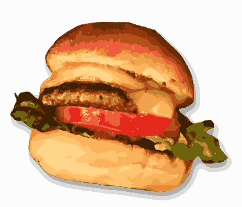

# Burger Bounce

A bouncing transparent PNG window written in x64 NASM assembly for Windows.



## Features

- **Transparent Layered Window** - Uses Windows layered window API with alpha channel transparency
- **Physics-Based Bouncing** - The burger bounces around the screen with configurable velocity
- **Drag & Throw** - Click and drag the burger, then release to "throw" it with momentum
- **Screen Bounds Detection** - Bounces off screen edges naturally
- **Embedded Resources** - PNG and icon are embedded directly in the executable
- **No Runtime Dependencies** - Pure Win32 API, no external libraries required

## Controls

| Key/Action | Behavior |
|------------|----------|
| **Left Click + Drag** | Move the burger window |
| **Release** | Throw with momentum (based on drag speed) |
| **ESC** | Exit immediately |

## Requirements

- Windows x64
- For building: NASM assembler, MSVC linker, Windows SDK

## Building

Run the build script from the `burger_bounce` directory:

```
build.bat
```

Or to build and run immediately:

```
build.bat run
```

## Technical Details

- **Language:** x86-64 Assembly (NASM)
- **Graphics:** GDI+ for PNG loading, UpdateLayeredWindow for transparency
- **Architecture:** Pure Windows API, no C runtime dependency

### Files

| File | Description |
|------|-------------|
| `burger_bounce.asm` | Main assembly source code |
| `burger_bounce.rc` | Resource definition file |
| `burger.ico` | Application icon |
| `354975.png` | Embedded burger graphic |
| `build.bat` | Build script |

## Credits

### Graphic Asset

**Hamburger - Realistic Remix** by [j4p4n](https://openclipart.org/detail/354975/hamburger-realistic-remix)

- Source: OpenClipart
- License: Public Domain (CC0)
- The burger graphic is embedded directly in the executable.

## License

This project is released into the Public Domain (CC0). Feel free to use, modify, and distribute as you wish.